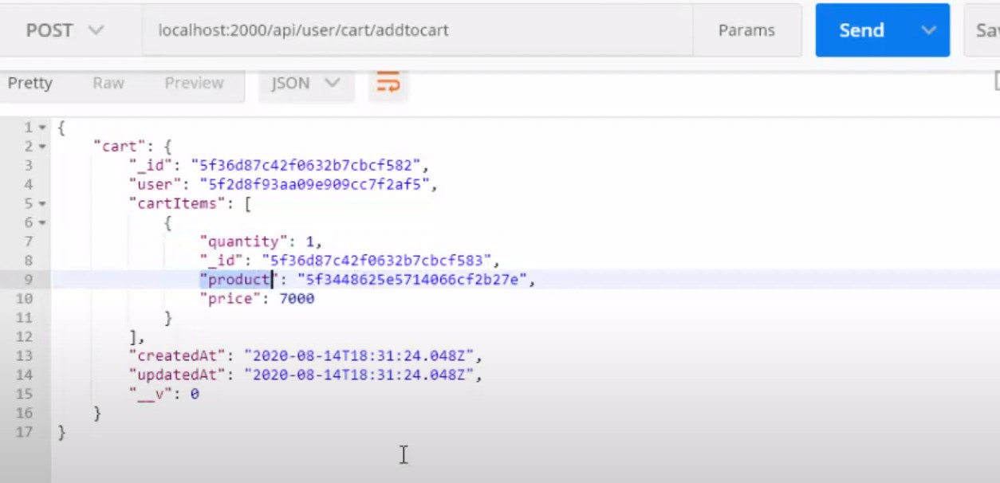
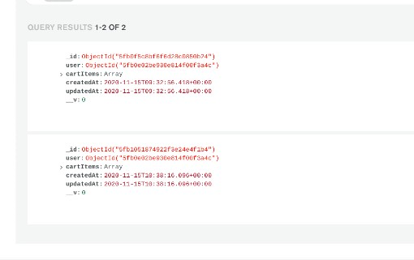
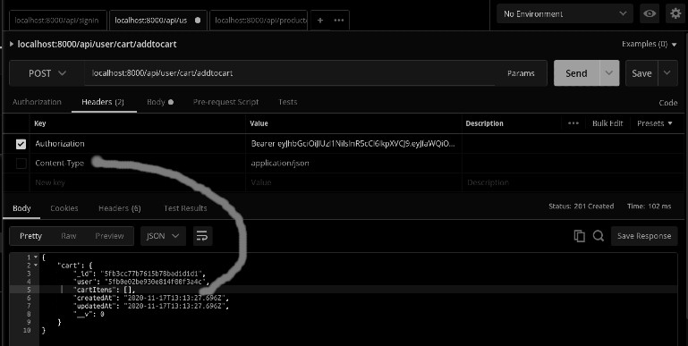
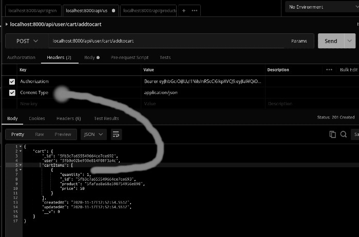
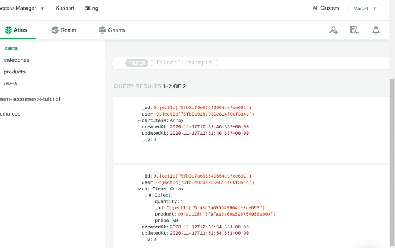
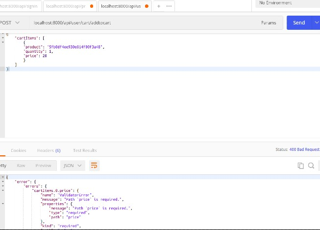
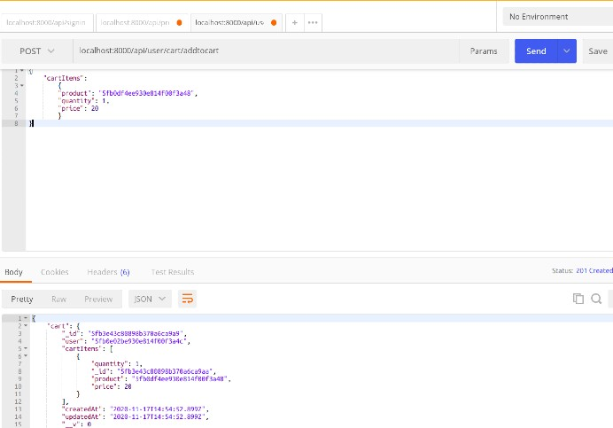
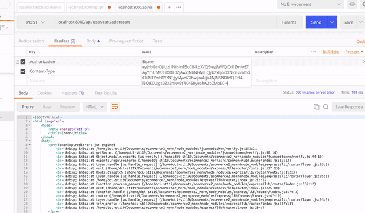
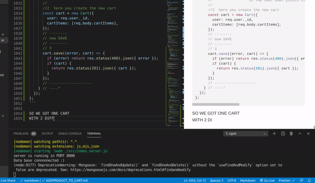

## ADD PRODUCT TO CART 🌻

_ONCE WE FINISH THE PRODUCT SET UP, IT S TIME TO PREPARE THE PRODUCT TO BE ADDED TO THE CART_

<br>

#### LETS UPDATE FEW THINGS BEFORE CONTINUING

- INSIDE THE auth.js/CONTROLLER

- ADD THE missing ROLE to the user

- ADD THE FOLLOWING:

```javascript
role: user.role;
```

- TO THIS:

```javascript

// -------------------------------------------
//
//        SIGN IN
//
// -------------------------------------------

exports.signin = (req, res) => {
  // the User is the imported data from the schema
  User.findOne({
    email: req.body.email,
  }).exec((error, user) => {
    // IF the user log in with something incorrect ,
    // launch an error message
    if (error)
      return res.status(400).json({
        error,
      });
    // ------ TOKEN | SESSION  ---------------------
    if (user) {
      // this authenticate is related to the function inside
      // the user.js /MODELS FOLDER
      if (user.authenticate(req.body.password)) {
        const token = jwt.sign(
          { _id: user._id, role: user.role },
          process.env.JWT_SECRET,
          {
            expiresIn: "1h",

```

<br>

#### IN THE ADMIN we already have this information stored, so dont bother!

<br>
<br>
<br>

## THE SHOPPING-CART :shopping_cart:

<br>

- CREATE THE SCHEMA
- CREATE THE ROUTES
- CREATE THE CONTROLLERS

<br>

##### CREATE THE SCHEMA

- - GO TO THE MODELS folder
- - CREATE THE SCHEMA for the CART
- - COPY the MODELS category.js
- - PASTE IT in the cart.js/models
- - REMOVE MOST OF THE STUFF and leave it like so:

```javascript
const mongoose = require("mongoose");
//
// -----------------------------------------
//
//              CART SCHEMA
//
// -----------------------------------------
//

const cartSchema = new mongoose.Schema({}, { timestamps: true });

module.exports = mongoose.model("Cart", cartSchema);
// DONT FORGET to change the name of the collection:
//  from this : "Category" to "Cart"
```

<br><br>

#### NOW IMPORT THE USER AND PRODUCT SCHEMAS

- MAKE THE CONNECTION OR REF to link these 2 schemas to the CART.js

<br>

```javascript
const mongoose = require("mongoose");
//
// -----------------------------------------
//
//              CART SCHEMA
//
// -----------------------------------------
//

const cartSchema = new mongoose.Schema(
  {
    // 1 import the user schema to make the reference
    user: { type: mongoose.Schema.Types.ObjectId, ref: "User", required: true },
    // so 1 user can buy serveral products, thats why you add the array
    cartItems: [
      {
        // 1 import the product schema to make the reference
        product: {
          type: mongoose.Schema.Types.ObjectId,
          ref: "Product",
          required: true,
        },
        quantity: { type: Number, default: 1 },
        // the default product is 1, so the basket cannot be empty
        price: { type: Number, required: true },
        // this is in case the price might vary in the future.
      },
    ],
  },
  { timestamps: true }
);

module.exports = mongoose.model("Cart", cartSchema);
```

<br><br>

##### CREATE THE cart.js/ROUTES

- - GO TO THE ROUTES category.js
- - COPY THE category.js
- - PASTE IT in the cart.js/ROUTES
- - REPLACE FEW THINGS

> THE NEW THINGS: will be the function called "addItemToCart"
> this function hasn't been created yet

<br>

```javascript
const express = require("express");
//HERE we are going to import the category schema
const { addItemToCart } = require("../controller/cart");
const { requireSignin, userMiddleware } = require("../common-middleware/index");
// Here we no longer need to add a adminMiddleware as normal user cannot add categories
// BUT what the user can do, is add to cart, therefore we need to put userMiddleware
const router = express.Router();
//
//
//           ****   C  *  A  *  R  *  T    ****
//
//
//
/*router.post(
    "/user/cart/add-to-cart",

    HERE YOU CAN WRITE anything you want like for example:

    /user/cart/add-to-basket
    etc etc...

    */
router.post(
  "/user/cart/addtocart",
  requireSignin,
  userMiddleware,
  addItemToCart
);
// instead of add category , the user will be able to addItemToCart);
// router.get("/category/getcategory", getCategories);  no longer needed!!!

module.exports = router;
```

<br>
<br>

#### NOW CREATE THE CONTROLLER/cart.js

- ADD THE FOLLOWING

- - IMPORT THE MODELS SCHEMA

<br>

```javascript
const Cart = require("../models/cart");
//
//
//                           ****   C  *  A  *  R  *  T    ****
//
// ----------------------
// A D D  item to CART
// ----------------------
//
exports.addItemToCart = (req, res) => {
  res.json({ message: "COWABUNGA TURTLE cart" });
};
```

<br>
<br>

#### NOW ADD THE cart.js/ROUTES to the INDEX.SERVER.JS file

```javascript
//
//---------------------
//  IMPORT the ROUTES
//---------------------
//
// cart
const cartRoutes = require("./routes/cart");
//
//
//
//---------------------
//   USE the ROUTES
//---------------------

//    C A R T .. ROUTES
app.use("/api", cartRoutes);
//
//
```

<br>
<br>

#### CHECK IF ALL IS OKAY IN THE SERVER THEN TEST IT ON POSTMAN

##### BEFORE testing the cart routes

- CREATE A NEW user (no admin)

- TYPE THE FOLLOWING URL:

`localhost:8000/api/signup`

- SIGN UP THE FOLLOWING DATA:

```javascript
{
     "firstName": "Cherubin",
    "lastName": "Ellon",
    "email": "cherubin@domain.com",
    "password": "enolagay"
}
//
// result
//
{
    "message": "User created Successfully"
}
```

<br>

##### NOW SIGNIN AND COPY THE TOKEN

- TYPE THE FOLLOWING URL:

`localhost:8000/api/signin`

```javascript
{

    "email": "cherubin@domain.com",
    "password": "enolagay"
}
//
// result
//

{
    "token": "ETC..ETC here IS WHERE THE TOKEN GOES",
    "user": {
        "_id": "5faffd16f9b3423b98f6b8d2",
        "firstName": "Cherubin",
        "lastName": "Ellon",
        "email": "cherubin@domain.com",
        "role": "user",
        "fullName": "Cherubin, Ellon"
    }
}

```

<br>
<br>

##### NOW YOU ARE READY TO TEST THE CART ROUTES

- ADD A NEW TAB

- TYPE THE FOLLOWING URL:

`localhost:8000/api/user/cart/addtocart`

- CREATE A HEADER "authorization" then add the Bearer and the token code

- ADD THE FOLLOWING:

```javascript
{
    "email": "cherubin@domain.com",
    "password": "enolagay1225"
}
```

> for this to work, you have to be logged in, ALSO check the url is like
> it should be!!

- SEND POST request

```javascript
// RESULT
{
    "message": "COWABUNGA TURTLE cart"
}
```

<br>
<br><br>
<br>

#### AFTER THE TEST, GO BACK TO THE CONTROLLER/cart.js

- hide this:

`res.json({ message: "COWABUNGA TURTLE cart" });`

- It should look like this

```javascript
const Cart = require("../models/cart");
//
//
//                           ****   C  *  A  *  R  *  T    ****
//
//
//
// ----------------------
// A D D  item to CART
// ----------------------
//
exports.addItemToCart = (req, res) => {
  //   res.json({ message: "COWABUNGA TURTLE cart" });

  const cart = new Cart({
    //   HERE BELOW: we are getting the user ID
    user: req.user._id,
    //
    cartItems: req.body.cartItems,
    /* HERE ABOVE: we are getting the usER CART(which is in cart.js/models), 
    you have the carItems array that contains a few things.
    */
  });

  //
  //
  //

  // ------------------
  // now SAVE the steps and HANDLE the ERRORS

  cart.save((error, cart) => {
    //
    // ERROR HANDLING
    // if there is an error, return a response 400 with a message json that says "error"
    if (error) return res.status(400).json({ error });
    // if the saving was successful, show the cart
    if (cart) {
      // if it s succesful, save the record
      //   and return the cart
      res.status(201).json({ cart });
    }
  });
};
```

<br>
<br>

#### NOW GO TO POSTMAN and test it

- CLICK ON THE IMAGE TO CHECK THE VIDEO(steps)

[](https://www.youtube.com/watch?v=xWoyfHJL6ZQ)

> ERROR: Somehow i am not getting the result i expect like in the image below:

[]()

> INSTEAD i am having the following result:

```javascript
{
    "cart": {
        "_id": "5fb0f5c8bf6f6d28c0850b24",
        "user": "5fb0e02be930e814f00f3a4c",
        "cartItems": [],
        "createdAt": "2020-11-15T09:32:56.418Z",
        "updatedAt": "2020-11-15T09:32:56.418Z",
        "__v": 0
    }
}
```

<br>

###### SINCE THE CODE IS GOING TO CHANGE, I AM GOING TO CONTINUE AND FIGURE IT OUT LATER.

<br>
<br>
<br>

#### After testing it, you can notice that the product has been recorded in MONGO, but it has been recorded several times forthe same user.

[]()

> THE ONLY issue with that, is that the product has been recorded twice like if it was for to different users, first of all we only need to have 1 cart for 1 user in which he can add MULTIPLE products.

#### TO RESTRICT THIS PROBLEM

- YOU HAVE TO WRITE A CONDITION

- READ THE COMMENTS

```javascript
const Cart = require("../models/cart");
//
//
//                           ****   C  *  A  *  R  *  T    ****
//
//
//
// ----------------------
// A D D  item to CART
// ----------------------
//
exports.addItemToCart = (req, res) => {
  //   res.json({ message: "COWABUNGA TURTLE cart" });

  // Cart.find   will check if the "user ID" already
  // exist, this means the cart is already created for the user and
  // there s no need to add a new cart
  Cart.findOne({ user: req.user._id }).exec((error, cart) => {
    if (error) return res.status(400).json({ error });
    if (cart) {
      //                 IF CART ALREADY EXISTS then update the cart by quantity
      //UPDATE the cart
      Cart.findOneAndUpdate(
        { user: req.user._id },
        {
          //   Cart.findOneAndUpdate(); will find the cart from the user._id and update it
          //  to test if you can push an update write the following:
          $push: {
            cartItems: req.body.cartItems,
          },
        } //------- without this below, you cannot see the result in postman
      ).exec((error, _cart) => {
        if (error) return res.status(400).json({ error });
        if (_cart) {
          return res.status(201).json({ cart: _cart });
        }
      }); //--------
      //
      //
      // just for now write the following
      //   res.status(200).json({ message: cart });
    } else {
      //                 IF THE CART DONT EXISTS then create a new cart
      //
      // here you create the NEW CART
      const cart = new Cart({
        user: req.user._id,
        cartItems: [req.body.cartItems],
      });
      // ------------------
      // now SAVE
      // ------------------
      cart.save((error, cart) => {
        if (error) return res.status(400).json({ error });
        if (cart) {
          return res.status(201).json({ cart });
        }
      });
    }
  });
};
```

### IMPORTANT !!! :construction:

- SINCE WE REMOVED THE ARRAY from the postman(where you type on raw)

```javascript
// before
[
 {
	"cartItems": {
   		"product": "5fafaa8a68a590754956e890",
   		"quantity": 1,
   		"price": 50
   	}
}
]
// after
{
	"cartItems": {
   		"product": "5fafaa8a68a590754956e890",
   		"quantity": 1,
   		"price": 50
   	}
}
```

<br>

- YOU NOW MUST TO ADD THE SQUARE BRAQUETS (array ) here:

```javascript
// cart.js/controllers
    } else {
      //                 IF THE CART DON'T EXISTS then create a new cart
      //
      // here you create the new cart
      const cart = new Cart({
        user: req.user._id,
        cartItems: [req.body.cartItems],
      });
```

## THE DOLLAR symbol 💲 ???

##### WHY DO YOU USE THE DOLLAR symbol like so:

```javascript
//UPDATE the cart
Cart.findOneAndUpdate(
  { user: req.user._id },
  {
    //   Cart.findOneAndUpdate(); will find the cart from the user._id and update it
    //  to test if you can push an update write the following:
    $push: {
      cartItems: req.body.cartItems,
    },
  } //------- without this below, you cannot see the result in postman
).exec;
```

##### \$ (update)

- The positional \$ operator identifies an element in an array to update without explicitly specifying the position of the element in the array.

  > https://docs.mongodb.com/manual/reference/operator/update/positional/

- According to the docs, a "\$" is reserved for operators. If you look at the group operator however, values need to have a dollar prefixed. These values are not operators. What does it mean in this context then? Example below:

> https://stackoverflow.com/questions/16264647/what-does-a-dollar-sign-mean-in-mongodb-in-terms-of-groups/16266807

<br>
<br>

## BACK TO THE ISSUE

##### AFTER SPENDING FEW HOURS TO UNDERSTAND WHY I WASNT GETTING THIS RESULT LIKE IN THE IMAGE:

- CLICK ON THE IMAGE TO CHECK THE VIDEO(steps)

[](https://youtu.be/eO-W24gyDfA)
<br>

##### I DECIDED TO ASK FOR HELP :crab:

<p> One of my teachers made some tests, but ad the end told me to repeat the "product" and the "cart" steps, which i did, but with no success as the issue persisted </p>

##### THEN I ASKED MY OTHER TEACHER

<p> He Told me to do some tests with the req.body but it didnt work, then to check express version, after that he told me to check the body parser, he wanted to see if i had one, as sometimes people forget to add it and it causes a lot of trouble, but i had it, anyway he asked me to add other body parsers, and the code still didnt work, he told me then to change the position of the body parser as it has to be above the routers(also a cause for a lot of issues) at the end he asked me to check the postman, and there was the problem </p>

<br>
<br>

### THE PROBLEM WAS DUE TO POSTMAN

> CHECK THE 2 IMAGES AND SEE THE DIFFERENCES

## I WILL TRY THE BASIC CODE

- THE BASIC CODE BEFORE WE DO THE CHANGES RELATED TO THE Cart.findOneAndUpdate(

- AS IT S EASIER TO SEE THE ISSUE

##### THE CODE AND THE RESULT

```javascript
const express = require("express");
const Cart = require("../models/cart");

exports.addItemToCart = (req, res) => {
  const cart = new Cart({
    user: req.user._id,
    cartItems: req.body.cartItems,
  });

  // ------
  cart.save((error, cart) => {
    if (error) return res.status(400).json({ error });
    if (cart) {
      return res.status(201).json({ cart });
    }
  });
};

//
// the result in postman
{
    "cart": {
        "_id": "5fb3ddafcb8c4b2abcd54631",
        "user": "5fb0e02be930e814f00f3a4c",
        "cartItems": [
            {
                "quantity": 1,
                "_id": "5fb3ddafcb8c4b2abcd54632",
                "product": "5fb0df4ee930e814f00f3a48",
                "price": 20
            }
        ],
        "createdAt": "2020-11-17T14:26:55.417Z",
        "updatedAt": "2020-11-17T14:26:55.417Z",
        "__v": 0
    }
}
```

<br>

###### fail!!!

[]()

###### success!!!

[]()

###### MONGO RESULT

- here you see how the 2 products appear after sending the post request

[]()

<br>

### NOW TEST IT WITH THE: Cart.findOneAndUpdate(

- The Cart.findOneAndUpdate( is used so that the user dont create several cart when adding products, but instead we update his cart and add all the products to ONE single cart

##### the code

```javascript
const express = require("express");
const Cart = require("../models/cart");
//
//
//                           ****   C  *  A  *  R  *  T    ****
//
//
//
// ----------------------
// A D D  item to CART
// ----------------------
//1
exports.addItemToCart = (req, res) => {
  // Cart.findOne({ user: req.user._id })
  //  this is going to check the user._id in the collection
  // inside mongo to see if he already exists
  // 4
  Cart.findOne({ user: req.user._id }).exec((error, cart) => {
    //
    // 5
    if (error) return res.status(400).json({ error });
    if (cart) {
      //                 IF CART ALREADY EXISTS then update the cart by quantity
      //
      //
      //find the user with that id and then UPDATE the cart
      // https://mongoosejs.com/docs/api.html#model_Model.findByIdAndUpdate
      //  7
      Cart.findOneAndUpdate(
        { user: req.user._id },
        {
          //  $push: is going to push the record in a sub-collection
          $push: {
            // here you add the name of the key
            cartItems: req.body.cartItems,
          },
        } //8
      ).exec((error, _cart) => {
        if (error) return res.status(400).json({ error });
        if (_cart) {
          return res.status(201).json({ cart: _cart });
        }
      }); //--------
    } else {
      //° 6 inside the 6 you have to introduce the step 2 and 3
      //                 IF THE CART DONT EXISTS then create a new cart
      //
      //2  here you create the new cart
      const cart = new Cart({
        user: req.user._id,
        cartItems: [req.body.cartItems],
      });
      // --------
      // now SAVE
      // --------
      // 3
      cart.save((error, cart) => {
        if (error) return res.status(400).json({ error });
        if (cart) {
          return res.status(201).json({ cart });
        }
      });
      // -------------------
    } // ----°
  });
};
```

<br>

##### I NOTICED THERE WAS SOMETHING WRONG WITH THE RESULT AGAIN

<p>When following the steps from the tutorial, i remember that he mentioned that once we started with the  Cart.findOne({ , we had to remove the array inside the postman, the reasons for that is that here:</p>

```javascript
Cart.findOneAndUpdate(
  { user: req.user._id },
  {
    //  $push: is going to push the record in a sub-collection
    $push: {
      cartItems: req.body.cartItems,
    },
  }
).exec;
```

<p>The reasons for that is that here you are grabbing the cartItems object, and here you grab the array , like it was in the beginning, i dont get too much why of this so i will ask one of my teachers </p>

- here is where it transforms it in an array

```javascript
// here you create the new cart
const cart = new Cart({
  user: req.user._id,
  cartItems: [req.body.cartItems],
});
// ------------------
// now SAVE
// ------------------
```

###### ARRAY

[]()

###### NO ARRAY

[]()

##### So now its working well !!!

<br>
<br>
<br>

## NEXT STEP 🌻

#### WE HAVE TO CHECK "IF THE PRODUCT ALREADY EXISTS" inside the user cart , so to not add more, but instead create a single product that will update everytime the user purchase another one.

<br>

- WE WILL START WITH THIS:

```javascript
  if (cart) {
      //
      //
      //9 IF  PRODUCT already exists in the cart, then
      // c will stand for see, so c. is helping to see if the product already exists in the cartItems from the user
      const isItemAdded = cart.cartItems.find((c) => c.product == req.body.cartItems.product);

if(isItemAdded) {

}else{

}

```

#### INSIDE OF THE IF /ELSE of the STEP 11

- we will add the step 7 and 8
- the ones below

```javascript
//                 IF CART ALREADY EXISTS then update the cart by quantity
//find the user with that id and then UPDATE the cart
// https://mongoosejs.com/docs/api.html#model_Model.findByIdAndUpdate
//  7
Cart.findOneAndUpdate(
  { user: req.user._id },
  {
    //  $push: is going to push the record in a sub-collection
    $push: {
      // here you add the name of the key
      cartItems: req.body.cartItems,
    },
  } //8
).exec((error, _cart) => {
  if (error) return res.status(400).json({ error });
  if (_cart) {
    return res.status(201).json({ cart: _cart });
  }
});
```

#### YOU SHOULD ADD THEM LIKE SO

- INSIDE OF THE IF, you should add a copy of the 7 and 8 but we will add it later, first forcus on the ELSE

```javascript
//9                 IF  PRODUCT already exists in the cart
// c will stand for see,
// so c. is helping to see if the product already exists in the cartItems from the user
const isItemAdded = cart.cartItems.find(
  (c) => c.product == req.body.cartItems.product
);
// 10
if (isItemAdded) {
  //
  //
  // if product already exists / or added
  //
  //
} else {
  // add step 7 and 8 inside
  //
  //                 IF CART ALREADY EXISTS then update the cart by quantity
  //find the user with that id and then UPDATE the cart
  // https://mongoosejs.com/docs/api.html#model_Model.findByIdAndUpdate
  //  7
  Cart.findOneAndUpdate(
    { user: req.user._id },
    {
      //  $push: is going to push the record in a sub-collection
      $push: {
        // here you add the name of the key
        cartItems: req.body.cartItems,
      },
    } //8
  ).exec((error, _cart) => {
    if (error) return res.status(400).json({ error });
    if (_cart) {
      return res.status(201).json({ cart: _cart });
    }
  }); //-------- Cart.findOneAndUpdate , exec related
```

#### NOW THE IF

- INSIDE OF THE "if" YOU SHOOULD ADD THE FOLLOWING

```javascript
      // 10 create the if/else
      if (item) {
        // 12
        // if product already exists / or added
        //
        //  7 copy
        Cart.findOneAndUpdate(
          // cartItems.product , carItems is a property and you can select a sub property with a dot, product is the value
          { user: req.user._id, "cartItems.product": product },
          {
            //  $push: is going to push the record in a sub-collection
            $set: {
              // instead of push add "set", set is going to update the item
              // here you add the name of the key
              cartItems: {
                ...req.body.cartItems,
                quantity: item.quantity + req.body.cartItems.quantity,
                // the req.body.cartItems.quantity concerns whatver the quantity we have
              },
            },
          } //8
        ).exec((error, _cart) => {
          if (error) return res.status(400).json({ error });
          if (_cart) {
            return res.status(201).json({ cart: _cart });
          }
        }); //-------- Cart.findOneAndUpdate , exec related
```

<br>
<br>

- HERE IS DIDNT ADD THE const product, you will find it below in the next code

> I USED "PUSH" TO push the item inside the cart
> I USED "set" to update the item inside the cart, so to not repeat the same product several times.

### CHECK THE STEPS

- CLICK ON THE IMAGE TO FOLLOW THE STEPS, AS IT CAN BE COMPLICATED TO NARRATE

[](https://youtu.be/1fP-Qx3eFBg)

<br>
<br>

### THE WHOLE CODE

```javascript
const express = require("express");
const Cart = require("../models/cart");
//
//
//                           ****   C  *  A  *  R  *  T    ****
//
//
//
// ----------------------
// A D D  item to CART
// ----------------------
//1
exports.addItemToCart = (req, res) => {
  // Cart.findOne({ user: req.user._id })
  //  this is going to check the user._id in the collection
  // inside mongo to see if he already exists
  // 4
  Cart.findOne({ user: req.user._id }).exec((error, cart) => {
    //
    // 5
    if (error) return res.status(400).json({ error });
    if (cart) {
      // 13
      const product = req.body.cartItems.product;
      //
      //9                 IF  PRODUCT already exists in the cart
      // c will stand for see,
      // so c. is helping to see if the product already exists in the cartItems from the user
      const item = cart.cartItems.find((c) => c.product == product);
      //

      //
      //
      // 10 create the if/else
      if (item) {
        // 12
        // if product already exists / or added
        //
        //  7 copy
        Cart.findOneAndUpdate(
          // cartItems.product , carItems is a property and you can select a sub property with a dot, product is the value
          { user: req.user._id, "cartItems.product": product },
          {
            //  $push: is going to push the record in a sub-collection
            $set: {
              // instead of push add "set", set is going to update the item
              // here you add the name of the key
              cartItems: {
                ...req.body.cartItems,
                quantity: item.quantity + req.body.cartItems.quantity,
                // the req.body.cartItems.quantity concerns whatver the quantity we have
              },
            },
          } //8
        ).exec((error, _cart) => {
          if (error) return res.status(400).json({ error });
          if (_cart) {
            return res.status(201).json({ cart: _cart });
          }
        }); //-------- Cart.findOneAndUpdate , exec related
        //
      } else {
        // 11
        // add step 7 and 8 inside
        //
        //                 IF CART ALREADY EXISTS then update the cart by quantity
        //find the user with that id and then UPDATE the cart
        // https://mongoosejs.com/docs/api.html#model_Model.findByIdAndUpdate
        //  7 original
        Cart.findOneAndUpdate(
          { user: req.user._id },
          {
            //  $push: is going to push the record in a sub-collection
            $push: {
              // here you add the name of the key
              cartItems: req.body.cartItems,
            },
          } //8
        ).exec((error, _cart) => {
          if (error) return res.status(400).json({ error });
          if (_cart) {
            return res.status(201).json({ cart: _cart });
          }
        }); //-------- Cart.findOneAndUpdate , exec related
      } //-------- related to  (c) => c.product == req.body.cartItems.product
    } else {
      //° 6 inside the 6 you have to introduce the step 2 and 3
      //                 IF THE CART DONT EXISTS then create a new cart
      //
      //2  here you create the new cart
      const cart = new Cart({
        user: req.user._id,
        cartItems: [req.body.cartItems],
      });
      // --------
      // now SAVE
      // --------
      // 3
      cart.save((error, cart) => {
        if (error) return res.status(400).json({ error });
        if (cart) {
          return res.status(201).json({ cart });
        }
      });
      // -------------------
    } // ----°
  });
};
```

[]()

<br>
<br>
<br>

## THE CODE WORKS but ... :cherries:

### THERE IS A BUG when adding the items to cart

- _THE ISSUE_

> START BY DELETING THE CART

> when you delete the cart for example and then you add again a product, you will see for example 3 products of the same, until then everything is fine! but once you choose to add another product (3 to 4 more) with another id code, you will notice that the first product disappeared, that is what we are going to solve now-
