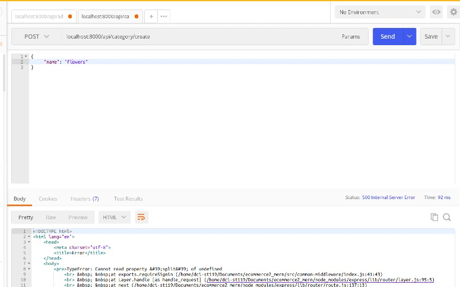
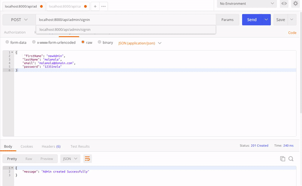
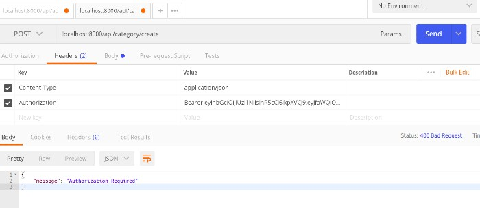
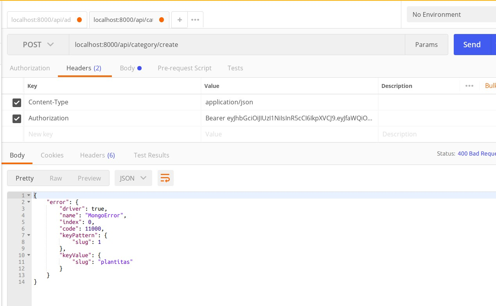
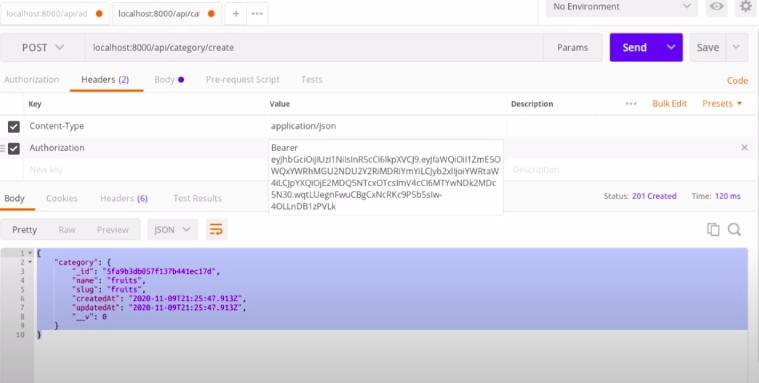

## A D M I N - C A T E G O R Y  :closed_lock_with_key:


##### CREATE THE AUTHENTICATION (only logged in users"admin") CAN CREATE A CATEGORY

<br>

*ONLY THE ADMIN HAVE SOME PERMISSION TO WRITE THE CATEGORIES*

- GO TO THE COMMON-MIDDLEWARE

- inside the index.js add the following:

 <br>

```javascript
//
//      A D M I N  -- C A T E G O R Y
//
// -------------------------------------------
//
//  ONLY LOGGED IN ADMIN CAN CREATE CATEGORIES
//             middleware
//
// -------------------------------------------
//
exports.adminMiddleware = (req, res, next) => {
  // NO PERMISSION if its not an ADMIN
  // if the user is not !== an admin , it will launch a res.status 400
  if (req.user.role !== "admin") {
    return res.status(400).json({ message: "Access denied" });
  }
  next();
};
```

<br>

##### NOW GO TO THE CATEGORY ROUTES and add the "requireSignin" function.

- THIS FUNCTION IS GOING TO CHECK THE ROLE OF THE USER, AND DEPENDING ON THAT , it will allow the user(ADMIN) to WRITE categories.

<br>

```javascript
// NEW to add
const { requireSignin } = require("../common-middleware/index");

//
router.post("/category/create", requireSignin, addCategory);
```

#### HOW IT S GOING TO CHECK IF THE USER ITS AN ADMIN?

- IT WILL GO TO THE index.js/ COMMON-MIDDLEWARE and will verify the user inside the following function:

```javascript
// index.js/ COMMON-MIDDLEWARE
exports.requireSignin = (req, res, next) => {
  const token = req.headers.authorization.split(" ")[1];
  // BELOW: its verifying the user
  const user = jwt.verify(token, process.env.JWT_SECRET);
  // BELOW is attaching the user
  req.user = user;
  // after verifying and attaching the user, it will forward the REQUEST to the NEXT() function
  next();
  // The NEXT() function will be in the category.js/routes , and the specific function will be adminMiddleware that is back inside the: index.js/ COMMON-MIDDLEWARE
};
```

<br>

##### SO AFTER being checked there it will go back to the category.js/routes , and there you will add this:

- SO WHEN the next() send the request to the next function which is inside the category.js/routes, this function is going to be checked inside the index.js/ COMMON-MIDDLEWARE

```javascript
// NEW TO ADD ... adminMiddleware
const {
  requireSignin,
  adminMiddleware,
} = require("../common-middleware/index");
//
//
router.post("/category/create", requireSignin, adminMiddleware, addCategory);
```

#### WHICH IS the function we just created :

```javascript
exports.adminMiddleware = (req, res, next) => {
  // NO PERMISSION if its not an ADMIN
  // if the user is not !== an admin , it will launch a res.status 400
  if (req.user.role !== "admin") {
    return res.status(400).json({ message: "Access denied" });
  }
  next();
};
```

<br>

#### IF the user is the "ADMIN", then it will execute this function "addCategory" which is the function that allows to CREATE A CATEGORY :

```javascript
// category.js /routes
const {
  requireSignin,
  adminMiddleware,
} = require("../common-middleware/index");
//
//
router.post("/category/create", requireSignin, adminMiddleware, addCategory);

// category.js/controller
// THE addCategory FUNCTION

exports.addCategory = (req, res) => {
  const categoryObj = {
    name: req.body.name,
    slug: slugify(req.body.name),
  };
  if (req.body.parentId) {
    categoryObj.parentId = req.body.parentId;
  }
  const cat = new Category(categoryObj);
  //
  //   ------------
  cat.save((error, category) => {
    if (error) return res.status(400).json({ error });

    if (category) {
      // if there is no error, it will add the category you added
      return res.status(201).json({ category });
      //   201 success
    }
  });
  //   ------------
  //
};
```

<br>

##### NOW GO TO POSTMAN and check



- AS YOU CAN SEE it shows an error

- The error is related to the headers

- that s why you need to put this code inside an if statement:

### IF

```javascript
exports.requireSignin = (req, res, next) => {
  //
  // --------------- if statement  ***
  // if this exists and its not undefined: if (req.headers.authorization)
  //  then execute the code inside the if statement
  if (req.headers.authorization) {
    const token = req.headers.authorization.split(" ")[1];
    // [1] is going to grab the token from the words "Bearer token"
    const user = jwt.verify(token, process.env.JWT_SECRET);
    req.user = user;
    // so that i can access that user in the next function
    next();
    // jwt.verify();
    // jwt.decode);
    // with the above you decode the TOKEN
  }
  // ---------------  if statement  ***
};
```

### ELSE

```javascript
return res.status(400).json({ message: "Authorization Required" });
```

<br>

#### NOW TEST IT in POSTMAN


- IF YOU DELETED THE ADMIN USER OR FORGOT THE PASSWORD, you will have to create another ADMIN USER

- IF YOU CHANGED the PORT, you will have to change that in the url

```javascript
// URL BEFORE , you should have spaces when testing it in postman
localhost: 2000 / api / admin / signup;
// URL AFTER
localhost: 8000 / api / admin / signup;
```

- IF YOU HAVE OTHER TABS with the same path like so, it wont work, so you will have to close them all:

`/admin/signup`

<!--

{
     "firstName": "newAdmin",
    "lastName": "molamola",
    "email": "molamola@domain.com",
    "password": "12351nola"
} -->

<br>

#### AFTER ALL THIS, log you in with this:

```javascript
    "email": "molamola@domain.com",
    "password": "12351nola"
```



#### COPY THE TOKEN thats is going to be available for 1 hour


### AFTER YOU SIGN IN and that you copy the token, paste the token like so:

- IF a message with "required" shows, sign in again and get the new token


###### THERE IS GOING TO be an error linked to the JWT "required"

- add the following:

`const jwt = require("jsonwebtoken");`

- like so:

```javascript
// index.js / common-middleware FOLDER
const jwt = require("jsonwebtoken");

//            A . D .M . I . N
//
// -------------------------------------------
//
//           VERIFY A TOKEN
//             middleware
//
// -------------------------------------------

exports.requireSignin = (req, res, next) => {
  //
  //
  // if this exists and its not undefined: if (req.headers.authorization)
  //  then execute the code inside the if statement
  if (req.headers.authorization) {
    const token = req.headers.authorization.split(" ")[1];
    // [1] is going to grab the token from the words "Bearer token"
    const user = jwt.verify(token, process.env.JWT_SECRET);
    req.user = user;
    // so that i can access that user in the next function
    next();
    // jwt.verify();
    // jwt.decode);
    // with the above you decode the TOKEN
  }
  return res.status(400).json({ message: "Authorization Required" });
};
```

#### CHECK THE VIDEO for more errors

- ERROR 1 (click on the link to watch the video)

[error ADMIN auth | create category](https://www.youtube.com/watch?v=hSfJHcpiFGk)

- ERROR 1 solved (explanation)
- (click on the image to watch the video)

[](https://www.youtube.com/watch?v=JAODSEv45wE)

- ERROR 2 was due to the next()

- the next() has to be in position to go to the next function, otherwise it will block or will not work correctly

##### THE WRONG WAY of positioning the next()

```javascript
exports.requireSignin = (req, res, next) => {
  //
  // INDEX.JS /COMMON-MIDDLEWARE

  if (req.headers.authorization) {
    const token = req.headers.authorization.split(" ")[1];

    const user = jwt.verify(token, process.env.JWT_SECRET);
    req.user = user;

    next(); // THE REASON OF THE 2 ERROR, the next() is supposed to go to the next and if you put it here, it will not bother about the     return res.status(400).json({ message: "Authorization Required" });  , so you have to put it after
  } else {
    return res.status(400).json({ message: "Authorization Required" });
  }
  // next(); // HERE !!!!!!!!
};
```

#### where it should be

```javascript
    // next();  // THE REASON OF THE 2 ERROR, the next() is supposed to go to the next and if you put it here, it will not bother about the     return res.status(400).json({ message: "Authorization Required" });  , so you have to put it after
  } else {
    return res.status(400).json({ message: "Authorization Required" });
  }
  next(); // HERE !!!!!!!!
};
```

[](https://www.youtube.com/watch?v=fTWdlxCc6XM)

- As you can see, the category "plantitas" was created but
  was created with an error, but once you position the next( ), after the if/else statement you will see that the category was created without any error.



<br>

#### NOW ADD THE OTHER MIDDLEWARE FOR THE USER category

- add this inside the index.js/ common-middleware:

```javascript
exports.userMiddleware = (req, res, next) => {
  if (req.user.role !== "user") {
    return res.status(400).json({ message: " User access denied" });
  }
  next();
};
```

- You can notice that here you add !== "user" instead of admin

<br>
<br>

##### Both together should look like so:
<br>

```javascript
//      U S E R  -- C A T E G O R Y
//
// -------------------------------------------
//
//  ONLY LOGGED IN USER CAN CREATE CATEGORIES
//             middleware
//                  new *******
// -------------------------------------------
//
exports.userMiddleware = (req, res, next) => {
  // NO PERMISSION if its not an ADMIN
  // if the user is not !== an admin , it will launch a res.status 400
  if (req.user.role !== "user") {
    return res.status(400).json({ message: " User access denied" });
  }
  next();
};
//      A D M I N  -- C A T E G O R Y
//
// -------------------------------------------
//
//  ONLY LOGGED IN ADMIN CAN CREATE CATEGORIES
//             middleware
//
// -------------------------------------------
//
exports.adminMiddleware = (req, res, next) => {
  // NO PERMISSION if its not an ADMIN
  // if the user is not !== an admin , it will launch a res.status 400
  if (req.user.role !== "admin") {
    return res.status(400).json({ message: "Admin Access denied" });
  }
  next();
};
```