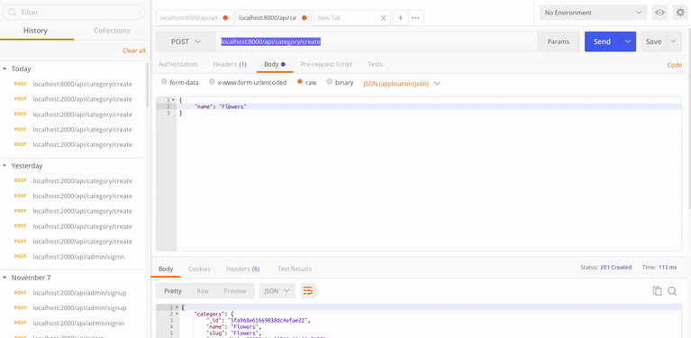

# CATEGORY 🌻

<p>FIRST WE WILL START WITH THE CATEGORY , THEN WITH THE SUBCATEGORIES AND THEN THE BRANCHES NESTED INSIDE THE SUBCATEGORIES </p>

<br>


### BEFORE STARTING :

- INSIDE THE SRC FOLDER, CREATE A NEW FOLDER called common-middleware

- INSIDE THE common-middleware folder add a file called: index.js

- INSIDE THE index.js/common-middleware paste this 2 middlewares, from the CONTROLLER FOLDER.

<br>

```javascript
//            U . S . E . R
//
// -------------------------------------------
//
//           VERIFY A TOKEN
//             middleware
//
// -------------------------------------------

exports.requireSignin = (req, res, next) => {
  const token = req.headers.authorization.split(" ")[1];
  // [1] is going to grab the token from the words "Bearer token"
  const user = jwt.verify(token, process.env.JWT_SECRET);
  req.user = user;
  // so that i can access that user in the next function
  next();
  // jwt.verify();
  // with the above you decode the TOKEN
};

//            A . D .M . I . N
//
// -------------------------------------------
//
//           VERIFY A TOKEN
//             middleware
//
// -------------------------------------------

exports.requireSignin = (req, res, next) => {
  const token = req.headers.authorization.split(" ")[1];
  // [1] is going to grab the token from the words "Bearer token"
  const user = jwt.verify(token, process.env.JWT_SECRET);
  req.user = user;
  // so that i can access that user in the next function
  next();
  // jwt.verify();
  // jwt.decode);
  // with the above you decode the TOKEN
};
```

#### AFTER YOU DO THE CHANGES, THE SERVER HAS TO BE WORKING PERFECTLY LIKE SO:

```javascript
server is running in PORT 2000
Data base connnnnected :)
```

<br>

#### GO TO THE index.server.js AND REPLACE THE "BODY PARSER"

- REPLACE THE OLD BODY PARSER FOR THE EXPRESS

```javascript
// REMOVE THE FOLLOWING
const bodyParser = require("body-parser");
app.use(bodyParser());

// AND ADD THE FOLLOWING INSTEAD

app.use(express.json());
```

<br>

### :corn: :corn: GO TO THE MODELS and create a new file where you will add the following:

<br>

##### CATEGORIES and SUB CATEGORIES (schema for the products)

- INSIDE THE MODELS add the category.js file

- INSIDE THE category.js , import the following:

```javascript
const mongoose = require("mongoose");
```

<br>

##### CREATE THE SCHEMA

- INSIDE THE category.js add the following:

```javascript
// -----------------------------------------
//
//              CATEGORY SCHEMA
//
// -----------------------------------------
//
const categorySchema = new mongoose.Schema(
  {
    name: {
      type: String,
      required: true,
      trim: true,
    },
    slug: {
      type: String,
      required: true,
      unique: true,
    },
    parentId: {
      type: String,
    },
  },
  { timestamps: true }
);

module.exports = mongoose.model("Category", categorySchema);
```

<br>

##### WHAT IS A SLUG ?

<p>A slug is a human-readable, unique identifier, used to identify a resource instead of a less human-readable identifier like an id. You use a slug when you want to refer to an item while preserving the ability to see, at a glance, what the item is.</p>

> " they’ve added a short uuid to the end of it. The only reason I’d think of for doing that is if a user was able to write two stories with the same title "

<p>Typically slugs are used when making search-engine optimised urls, so for example the url of this post is https://medium.com/@davesag/whats-a-slug-f7e74b6c23e0. There are actually two slugs in that url, my username, @davesag and the slug for this specific post, whats-a-slug-f7e74b6c23e0. Of that the whats-a-slug part comes from the title, and, for reasons only known to the people at Medium, they’ve added a short uuid to the end of it. The only reason I’d think of for doing that is if a user was able to write two stories with the same title, so I guess that can happen.
</p>

<br>

[article by Dave Sag](https://itnext.io/whats-a-slug-f7e74b6c23e0)

<br>

##### EXAMPLE to remove:

- Remove
  `For example, to remove *+~.()'"!:@ from the result slug, you can use slugify('..', {remove: /[*+~.()'"!:@]/g}).`

[MORE slugify](https://www.npmjs.com/package/slugify)

<br>

### video of SLUGIFY works:

[Create a safe and user friendly URL with slugify](https://youtu.be/XPGOkxExvMU)

<br>
<br>

## CREATE ROUTES FOR THE "Category"

- GO TO THE ROUTES FOLDER

_CATEGORY is a part of BOTH " user as well as admin"_

##### FOR USERS

- the user, they can explore the category, click on them and explore the dIfferent kind of products.

##### FOR ADMINS

- the ADMIN will create the category and also they will explore
  and they might delete some categories.

<br>

#### INSIDE THE ROUTES , create the "category.js" file and add the following:

```javascript
const express = require("express");
//HERE we are going to import the category schema
const Category = require("../models/category");
const slugify = require("slugify");
const router = express.Router();
//
//
//           ****    C . A . T . E . G . O . R . Y   ****
//
//
// HERE YOU ARE GOING TO SPECIFY THE API
// /category/create
router.post("/category/create", (req, res) => {
  const categoryObj = {
    name: req.body.name,
    slug: slugify(req.body.name),
  };
  //if, the req.body.parentId exists, then we'll use the category object:  categoryObj.parentId
  if (req.body.parentId) {
    categoryObj.parentId = req.body.parentId;
  }
  //   else: it will not be available, so if the categoryObj.parentId dont exist.
  const cat = new Category(categoryObj);
  cat.save((error, category) => {
    if (error) return res.status(400).json({ error });
    if (category) {
      return res.status(201).json({ category });
    }
  });
});

module.exports = router;
```

#### NOW go to the index.server.js and add this:

```javascript
//---------------
// ROUTES

// categories
const categoryRoutes = require("./routes/category");
//----------------

//    C A T E G O R Y .. ROUTES
app.use("/api", categoryRoutes);
//----------------
```

<br>

#### CREATE the category on POSTMAN


<br>

##### RESULT CLUSTER :


<br>

##### CLICK ON THE IMAGE to see the steps:

[](https://youtu.be/VG1Ijx_XZLM)

<br>
<br>
<br>

##### CREATE MORE CATEGORIES IN POSTMAN


##### CHANGE THE CATEGORY FUNCTION from the routes to Controller

- COPY THE FOLLOWING

```javascript
(req, res) => {
  const categoryObj = {
    name: req.body.name,
    slug: slugify(req.body.name),
  };
  //if, the req.body.parentId exists,
  // then we'll use the category object:  categoryObj.parentId
  if (req.body.parentId) {
    categoryObj.parentId = req.body.parentId;
  }
  //  else: it will not be available, so if the categoryObj.parentId dont exist.
  const cat = new Category(categoryObj);
  //
  //   ------------
  cat.save((error, category) => {
    if (error) return res.status(400).json({ error });

    if (category) {
      // if there is no error, it will add the category you added
      return res.status(201).json({ category });
      //   201 success
    }
  });
  //   ------------
  //
};
```

<br>

- PASTE IT inside the new category.js / CONTROLLER

```javascript
// export the category from this file with: exports.addCategory

exports.addCategory = (req, res) => {
  const categoryObj = {
    name: req.body.name,
    slug: slugify(req.body.name),
  };

  if (req.body.parentId) {
    categoryObj.parentId = req.body.parentId;
  }

  const cat = new Category(categoryObj);
  //
  //   ------------
  cat.save((error, category) => {
    if (error) return res.status(400).json({ error });

    if (category) {
      // if there is no error, it will add the category you added
      return res.status(201).json({ category });
      //   201 success
    }
  });
  //   ------------
  //
};
```

- INSIDE THE ROUTES you will add the category like so:

```javascript
const express = require("express");
//HERE we are going to import the category schema
const Category = require("../models/category");
const { addCategory } = require("../controller/category");
const slugify = require("slugify");
const router = express.Router();
//
//
//           ****    C . A . T . E . G . O . R . Y   ****
//
//
// HERE YOU ARE GOING TO SPECIFY THE API
// /category/create
router.post("/category/create", addCategory);

module.exports = router;
```

<br>
<br>

#### AFTER THE CHANGES , test it in POSTMAN

- ERROR, if you have an error its due to the fact you didnt import the slugify to the category.js inside the controller, so add it like so:

```javascript
const Category = require("../models/category");
const slugify = require("slugify");
```

<br>

- NOW go to postman again and type a new category


<br>

##### NOW WRITE THE function to fetch the CATEGORY

```javascript
//
// FETCH or .getCategories

exports.getCategories = (req, res) => {
  // if you pass an empty object like so: .find({})  its going to  retrieve/GET all the data
  Category.find({}).exec((error, categories) => {
    if (error) return res.status(400).json({ error });
    //
    //
    //
    if (categories) {
      res.status(200).json({ categories });
    }
  });
};
```

<br>

##### Now go to the category.js/ROUTES and import the fetched category

```javascript
const express = require("express");
//HERE we are going to import the category schema
const { addCategory, getCategories } = require("../controller/category");
//
const router = express.Router();
//
//
//           ****    C . A . T . E . G . O . R . Y   ****
//
//
//
// /category/create
router.post("/category/create", addCategory);
router.get("/category/getcategory", getCategories);

module.exports = router;
```

<br>

##### GO TO POSTMAN AND MAKE A GET REQUEST


