## PRODUCT 🌻

_ONCE THE CATEGORY AND SUBCATEGORIES HAS BEEN CREATED, YOU CAN PROCEED WITH THE PRODUCTS_

<br>

#### START BY CREATING THE PRODUCT SCHEMA

```javascript
const mongoose = require("mongoose");
//
//
// -----------------------------------------
//
//           P R O D U C T  ***  SCHEMA
//
// -----------------------------------------
//
// This is a basic product schema, in the future you might add
// more columns
//
//
const productSchema = new mongoose.Schema(
  {
    name: {
      type: String,
      required: true,
      trim: true,
    },
    slug: {
      type: String,
      required: true,
      unique: true,
    },
    price: {
      type: Number,
      required: true,
    },
    description: {
      type: String,
      required: true,
      trim: true,
      //   max: 5000, this is for the length of the description
    },
    // this is not "required", because offers on a product are not something permanent.
    offer: {
      type: Number,
    },
    productPictures: [{ img: { type: String } }],
    // here we will tell "who" can write a review on the product
    // Ref: "User" }], YOU ARE MAKING REFERENCE to the User Schema we have inside the user.js/MODELS and what the User contains: module.exports = mongoose.model("User", userSchema);
    reviews: [
      // here we are going to use the LINKING, it means that the person posting a review must have an account
      {
        userId: { type: mongoose.Schema.Types.ObjectId, ref: "User" },
        review: String,
      },
      // So if that person needs to add a review, it needs to be logged in
      /* 
      Since we have already created the User and the Category and all what is related
 to authenticate to check if its a user logged in or if the user is an admin
 , it s much more easier.
 */
    ],
    category: {
      type: mongoose.Schema.Types.ObjectId,
      ref: "Category",
    },
    createdBy: {
      type: mongoose.Schema.Types.ObjectId,
      ref: "User",
    },
    updatedAt: Date,
  },
  { timestamps: true }
);

module.exports = mongoose.model("Product", productSchema);
```

###### _LIKE THIS you can link to already existent SCHEMAS_

```javascript

type: mongoose.Schema.Types.ObjectId, ref: "User",

//here you grab the Schema name you use to export your schema
ref: "User",

```

<br>

#### THEN ADD THE ROUTE connected to this PRODUCT SCHEMA

- GO TO THE ROUTES
- CREATE a product.js
- COPY the category content from the routes and paste it inside the products.js/ROUTES
- REPLACE the category data for the PRODUCT

```javascript
const express = require("express");
//HERE we are going to import the category schema
//  H I D E the following as we still have to create a controller for the product
// const { addCategory, getCategories } = require("../controller/category");
//
//
// import the Product S. C. H. E. M. A
const Product = require("../models/product");
//
// THE requireSignin and adminMiddleware is required for the AUTHENTICATION purposes
const {
  requireSignin,
  adminMiddleware,
} = require("../common-middleware/index");
const router = express.Router();
//
//
//                        ****  P R O D U C T     ****
//
//
//
// change the ROUTE name for this , instead of category add product
router.post("/product/create", requireSignin, adminMiddleware, (req, res) => {
  //  to test it
  res.status(200).json({ message: "Hello test" });
});
//
//  H I D E the following :
// router.get("/category/getcategory", getCategories);

module.exports = router;
```

<br>

##### SINCE we are going to UPLOAD images, we cannot send Json response, so we cannot accept json DATA

- START by testing it with this:

`res.status(200).json({message: "Hello test"})`

- GO TO POSTMAN and open another tab, choose POST, add this url and SEND: localhost:8000/api/product/create

- you will have the following ERROR like so:

```javascript
<!DOCTYPE html>
<html lang="en">
    <head>
        <meta charset="utf-8">
        <title>Error</title>
    </head>
    <body>
        <pre>Cannot GET /api/product/create</pre>
    </body>
</html>
```

<br>

##### GO TO the index.server.js and import the route related to the PRODUCT

```javascript
//---------------------
//  IMPORT the ROUTES
//---------------------
//
// product
const productRoutes = require("./routes/product");

//    P R O D U C T .. ROUTES
app.use("/api", productRoutes);
//
//
```

<br>

#### THE ERROR

```javascript
typeError: Invalid schema configuration: "User" is not a valid type at path 'ref'
```

##### IS RELATED to this :

```javascript
    reviews: [
      {
        userId: { type: mongoose.Schema.Types.ObjectId, ref: "User" },
        review: String,
      },
    ],

    // B E F O RE i had this:
userId: mongoose.Schema.Types.ObjectId, ref: "User",

// the correction:
userId: { type: mongoose.Schema.Types.ObjectId, ref: "User" },

```

<br>

##### NOW GO TO POSTMAN and test it again

```javascript
// R E S U L T
{
"message": "Authorization Required"
}
```

##### SO LOGIN

- COPY the token, in the new tab and add the headers again:

- key: Authorization | value: Bearer and the token code

<br>

##### NOW send the request again

<!--

[]()

 -->

[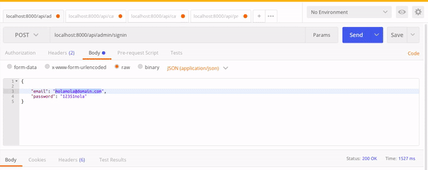]()

<br>
<br>

## NEXT STEP 🌻

<br>

#### INSTALL THE FOLLOWING

- install Multer
  `npm install --save multer`

##### What is a multer?

_Multer is a node. js middleware for handling multipart/form-data , which is primarily used for uploading files._

> NOTE: Multer will not process any form which is not multipart (multipart/form-data).

<br>

[MORE ABOUT MULTER](https://www.npmjs.com/package/multer)

[MULTER VIDEO TUTORIAL](https://www.youtube.com/watch?v=9Qzmri1WaaE)

### RELATED

<br>
<hr>
<br>

#### Uploading form fields and files at the same time with Multer (Node.js, Typescript)

- Multer is a widely used middleware to handle file uploads and multipart/form-data stuff received by your Node.js server application. There are tons of documentation and tutorials to teach you how to use Multer to upload files to your application. It’s not that simple to figure out how to upload files and form data at the same time though!

##### The problem

- As you probably know, form data can be submitted with various encodings, form-data or multipart/form-data being the oldest and most widely used. You can also use x-www-form-uuencoded, raw or json but neither of these can easily transfer a file.

> But Express and its body-parser extension can’t parse multipart/form-data. ThePOST request will invoke the appropriate route, but req.body will be undefined. Only Multer can save us. (Well, not really, but this article is about Multer.)

##### The solution

[READ MORE)](https://medium.com/developer-rants/uploading-form-fields-and-files-at-the-same-time-with-multer-node-js-typescript-c1a367eb8198)

<br>

# 🌻

<br>

- install SHORT ID
  `npm install --save shortid`

> NOTE: shortid is deprecated, because the architecture is unsafe. we instead recommend Nano ID, which has the advantage of also being significantly faster than shortid

##### ShortId creates amazingly short non-sequential url-friendly unique ids. Perfect for url shorteners, MongoDB and Redis ids, and any other id users might see.

- By default 7-14 url-friendly characters: A-Z, a-z, 0-9, \_-
- Supports cluster (automatically), custom seeds, custom alphabet.
- Can generate any number of ids without duplicates, even millions per day.
- Perfect for games, especially if you are concerned about cheating so you don't want an easily guessable id.
- Apps can be restarted any number of times without any chance of repeating an id.
- Popular replacement for Mongo ID/Mongoose ID.
- Works in Node, io.js, and web browsers.
- Includes Mocha tests.

[More about ShortId](https://www.npmjs.com/package/shortid)

##### WHAT SHORTID does , is to jelp you to create an UNIQUE ID for your files FILENAME

<br>
<hr>
<br>
<br>

### NEXT 🌻

<br>

##### CREATE THE PRODUCT CONTROLLER

- GO TO THE CONTROLLER FOLDER and add the product.js

##### NOW GO TO THE product.js/ROUTES

- INSIDE THE product.js replace the following

```javascript
//
//
//
//                        ****  P R O D U C T     ****
//                               routes
//
//
//
// REPLACE this
router.post("/product/create", requireSignin, adminMiddleware, (req, res) => {
  res.status(200).json({ message: "Hello test" });
});
//
//
//  FOR THIS
router.post("/product/create", requireSignin, adminMiddleware, createProduct);
```

##### it should look likes this:

```javascript
const express = require("express");
//HERE we are going to import the product schema
// THE requireSignin and adminMiddleware is required for :
// the AUTHENTICATION purposes
const {
  requireSignin,
  adminMiddleware,
} = require("../common-middleware/index");
const router = express.Router();
//
//
//
const { createProduct } = require("../controller/product");

//
//
//                        ****  P R O D U C T     ****
//                               routes
//
//
// change the ROUTE name for this , instead of category, add product
router.post("/product/create", requireSignin, adminMiddleware, createProduct);

module.exports = router;
```

<br>
<br>

##### MOVE the following imports

- MOVE the following imports to the product.js/controller

```javascript
// import the Product S. C. H. E. M. A
const Product = require("../models/product");
```

<br>

##### it should look likes this:

```javascript
//
//
//                        ****  P R O D U C T     ****
//                               controller
//
//
//
const Product = require("../models/product");

exports.createProduct = (req, res) => {
  res.status(200).json({ message: "hello product controller" });
};
```

<br>

#### GO TO POSTMAN 😎

- log in again (admin)
- copy the token
- paste the token inside the Bearer
- click send

[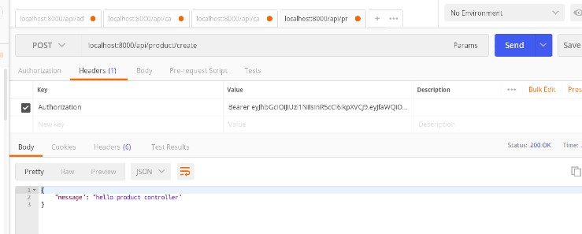]()

> RESULT: its working!!!

<br>
<hr>
<br>

##### GO to the product.js/CONTROLLER

- require ShortId

```javascript
const shortid = require("shortid");
```

##### GO to the product.js/ROUTES

- require MULTER

```javascript
const multer = require("multer");
```

- CREATE a variable called upload

_This will serve to link the destination FOLDER of the files_

```javascript
//
//    U S I N G **  M U L T E R
//
// const upload , is the destination folder
// ({ dest: 'uploads/'}) , are the files
const upload = multer({ dest: "uploads/" });
// dest: stands for destination, here we set up the destination of the images
```

<br>

##### ADD THE function related to molder inside the route

```javascript
router.post(
  "/product/create",
  requireSignin,
  adminMiddleware,
  upload.single("productPicture"),
  createProduct
);
/*
 where does multer "upload" the FILE INFORMATION?
 for a single file:
 file: req.file,

- single image
upload.single("productPicture"),

- multiple images
upload.array("productPicture"),


So this is the input field name of the product picture, we will
send from the POSTMAN
*/
```

#### NOW GO TO THE CONTROLLER/product.js

- delete this and add this instead

```javascript
// delete this
res.status(200).json({ message: "hello product controller" });
// replace it with this:
res.status(200).json({ file: req.file, body: req.body });
/*
  
  By default we are going to get a file:

  file: req.file, body: req.body });

  what is happening here:

  Since we won't be storing our images in a database, but rather a simple folder for brevity and simplicity, let's make another folder within our project folder and name it, say, uploads.

  but if we do it in this way it s going to generate it by itself.

  So from the MOMENT you are going to click save to what you just typed
  it s going to GENERATE A "uploads" FOLDER.
  


                                  SOME OPTIONS

test/server.js/app.all
app.all('/upload/single/truncated', (req, res) => {
  if (!req.files) {
   return res.status(400).send('No files were uploaded.');
  }

  // status 400 to differentiate from ending the request in the on limit
  return req.files.testFile.truncated
   ? res.status(400).send(`File too big`)
   : res.status(200).send('Upload succeed');
 });


https://www.codota.com/code/javascript/functions/express/Request/files
  */
```

<br>

[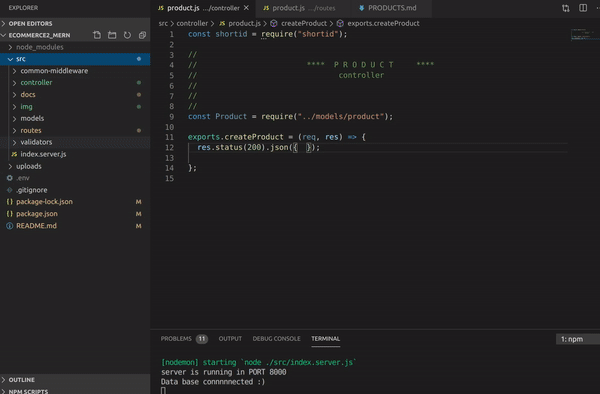]()

<br>
<br>

### RELATED

##### File Uploading Libraries

- There are several Node libraries available on NPM that can simplify the process of validating and uploading files to server. Among them, the most popular choice these days are Multer, Formidable, and Multiparty.

- Multer provides us control and flexibility when handling multipart/form-data requests - we get detailed information about each uploaded file, the ability to add a custom storage engine, validation of files according to our needs, the ability to set limits on uploaded files, etc.

- Project Setup
  Since we won't be storing our images in a database, but rather a simple folder for brevity and simplicity, let's make another folder within our project folder and name it, say, uploads.

[read More](https://stackabuse.com/handling-file-uploads-in-node-js-with-expres-and-multer/)

<br>
<br>

##### AFTER GENERATING THE "UPLOADS" FOLDER for the images

- GO TO POSTMAN

- INSTEAD OF USING RAW like with option: JSON (application/json)

- USE "form-data" , that is because its not a json file

- While choosing the form you will have 2 headers

| key  | value     |
| ---- | --------- |
| name | some text |

| key     | value |
| ------- | ----- |
| product | File  |

<br>

> Note: On the file, you have to click on the Text with the arrow to get the dropdown option

<br>

#### CLICK on the image :sunflower:

- WATCH the video to follow the steps

[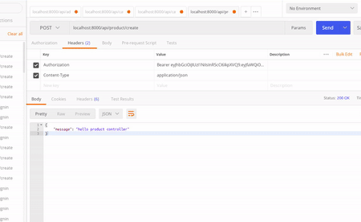](https://www.youtube.com/watch?v=WH10ezaubts)

##### IF YOU NOTICE

> INSIDE THE UPLOADS folder (where the uploads made via postman are stored), the images are unreadable/encrypted.

#### TO PREVENT THAT

- Go to the official multer page

- PASTE DE FOLLOWING CODE inside the products.js/ROUTES

```javascript
var storage = multer.diskStorage({
  destination: function (req, file, cb) {
    cb(null, "/tmp/my-uploads");
  },
  filename: function (req, file, cb) {
    cb(null, file.fieldname + "-" + Date.now());
  },
});
```

- REPLACE few things

```javascript
//                            ***      MULTER config   ***
//
// BEFORE CHANGES
//
// const storage = multer.diskStorage({
var storage = multer.diskStorage({
  destination: function (req, file, cb) {
    cb(null, "/tmp/my-uploads");
  },
  filename: function (req, file, cb) {
    cb(null, file.fieldname + "-" + Date.now());
  },
});
//
// AFTER CHANGES
//

var storage = multer.diskStorage({
  destination: function (req, file, cb) {
    cb(null, "../uploads");
    // original  CHANGE1: cb(null, '/tmp/my-uploads') from the original website
    // CHANGE2: cb(null, '../uploads')  but there was an error
  },
  filename: function (req, file, cb) {
    cb(null, shortid.generate() + "-" + file.originalname);
    // original name is what you got from the postman after the first result
  },
});
/*  check the original name inside the uploaded file in postman

{
   ****     "originalname": "Saint Ambrose with Ambrosius van Engelen.jpg",

  */
```

<br>

##### IMPORT THE FOLLOWING

```javascript
// IMPORT
const shortid = require("shortid");
const path = require("path");
```

<br>

#### GO TO THE CONTROLLER/product.js

- ADD THIS

```javascript
const shortid = require("shortid");

//
//                        ****  P R O D U C T     ****
//                               controller
//
//
//
const Product = require("../models/product");

exports.createProduct = (req, res) => {
  res.status(200).json({ file: req.file, body: req.body });
  // file:
  // in file you check the file name
  //   before
  //   res.status(200).json({ message: "hello product controller" });
};
/*
 where does multer "upload" the FILE INFORMATION?
 for a single file:
 file: req.file,
 */
```

<br>

#### BEFORE testing it again

- check if you have all this imports

```javascript
const express = require("express");
const {
  requireSignin,
  adminMiddleware,
} = require("../common-middleware/index");
//
const { createProduct } = require("../controller/product");

//
//    U S I N G **  M U L T E R
const multer = require("multer");
const router = express.Router();
const upload = multer({ dest: "uploads/" });
const shortid = require("shortid");
const path = require("path");
//

//
```

### AFTER DOING ALL THAT

- test it again

- YOU WILL NOTICE that the images are still in the generate UPLOADS folder that is outside the SRC folder

<br>

#### REPLACE THE FOLLOWING AND CHANGE THE POSITION (products.js/routes)

- take this line : const upload = multer({ dest: "uploads/" });

- move it here then change it, from ({ dest: "uploads/" }); to ({ storage });

```javascript
  filename: function (req, file, cb) {
    cb(null, shortid.generate() + "-" + file.originalname);
  },
});


// multer middleware **
// const upload = multer({ dest: "uploads/" });
const upload = multer({ storage });
```

##### SO YOU WILL HAVE to create the new UPLOADS folder manually

##### INSIDE THE SRC, add the new UPLOADS folder

> once you have done that, change this:

```javascript
const storage = multer.diskStorage({
  destination: function (req, file, cb) {
  // instead of adding this:     cb(null, '/tmp/my-uploads')
    // you will have to create a folder inside the src folder, in paralell to the server.index.js
    cb(null, path.join(path.dirname(__dirname), "uploads"));
    // you use this: __dirname to find the current directory of this file which is routes, so whenever we are using path.dirname,
    // its going to give the directory of current directory that is SRC
    // then you are going to add a last function path : path.join()
    // join in js: Convert the elements of an array into a string:
  },
```

<br>

##### RESULT

```javascript
{
    "file": {
        "fieldname": "productPicture",
        "originalname": "Saint Ambrose with Ambrosius van Engelen.jpg",
        "encoding": "7bit",
        "mimetype": "image/jpeg",
        "destination": "/home/dci-st119/Documents/ecommerce2_mern/src/uploads",
        "filename": "rADOzvcuy-Saint Ambrose with Ambrosius van Engelen.jpg",
        "path": "/home/dci-st119/Documents/ecommerce2_mern/src/uploads/rADOzvcuy-Saint Ambrose with Ambrosius van Engelen.jpg",
        "size": 207361
    },
    "body": {
        "name": "picture testoo"
    }
}
 /*
 where does multer "upload" the FILE INFORMATION?
 for a single file:
 file: req.file,
 */
```

<br>

#### THE SHORT ID preview in the result

- ShortId creates amazingly short non-sequential url-friendly unique ids. Perfect for url shorteners, MongoDB and Redis ids, and any other id users might see.

```javascript
filename": "rADOzvcuy-
// from
// "filename": "rADOzvcuy-Saint Ambrose with Ambrosius van Engelen.jpg",


```

<br>
<br>

#### THE WHOLE IMAGE UPLOAD code

```javascript
const express = require("express");
const {
  requireSignin,
  adminMiddleware,
} = require("../common-middleware/index");
//
const { createProduct } = require("../controller/product");

//
//    U S I N G **  M U L T E R
const multer = require("multer");
const router = express.Router();
const shortid = require("shortid");
const path = require("path");

//
//
//                        ****  P R O D U C T     ****
//                               routes
//
//
//                              MULTER config --------
// const storage = multer.diskStorage({
// multer.diskStorage
// Is where you want to store the data,
// its connected to:  const upload = multer({ storage });
//
// cb is the call back function, like the "done" in roberts example
const storage = multer.diskStorage({
  destination: function (req, file, cb) {
    cb(null, path.join(path.dirname(__dirname), "uploads"));
  },
  //
  //
  filename: function (req, file, cb) {
    cb(null, shortid.generate() + "-" + file.originalname);
  },
});

// multer middleware **
// const upload = multer({ dest: "uploads/" });
const upload = multer({ storage });
//
//
router.post(
  "/product/create",
  requireSignin,
  adminMiddleware,
  upload.array("productPicture"),
  createProduct
);

module.exports = router;
```

<br>

> multer.diskStorage
> Is where you want to store the data,
> its connected to this line we haven't yet created:

`const upload = multer({ storage }); `

<p>multer({ storage });
Is multer middleware

the multer middleware related upload.single("productPicture"),
here you tell multer which name you are going
to use for the image ("productPicture")

</p>

<br>
<br>

### MULTIPLE IMAGES 📷 🌻 🌻

- INSTEAD OF SETTING IT UP TO SINGLE , SET IT UP TO "ARRAY"

```javascript
// - single image
upload.single("productPicture"),

// - multiple images
upload.array("productPicture"),

```

- WATCH the video to follow the steps

[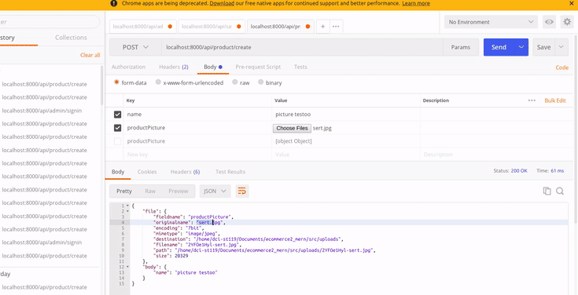](https://www.youtube.com/watch?v=BYHkemXgIEo)

<br>

#### TO SOLVE THE ERROR

> THE PROBLEM is due to the fact that we selected the ARRAY to handle multiple images, but we are not setting it up in the CONTROLLER/product.js

- THIS IS THE SET UP for a single file (morgan documentation)

```javascript
app.post("/profile", upload.single("avatar"), function (req, res, next) {
  // req.file is the `avatar` file
  // req.body will hold the text fields, if there were any
});
```

- THIS IS THE SET UP for a multiple files (morgan documentation)

```javascript
app.post("/photos/upload", upload.array("photos", 12), function (
  req,
  res,
  next
) {
  // req.files is array of `photos` files
  // req.body will contain the text fields, if there were any
});
```

###### IN THIS PROJECT I WILL JUST ADD THE S to the file

- LIKE SO:

```javascript
const Product = require("../models/product");

exports.createProduct = (req, res) => {
  res.status(200).json({ file: req.files, body: req.body });
  //   before ,the line below has the "file" for just a single image
  // res.status(200).json({ file: req.file, body: req.body });
};
```

<br>

##### SAVE AND TEST IT IN POSTMAN

##### RESULT

[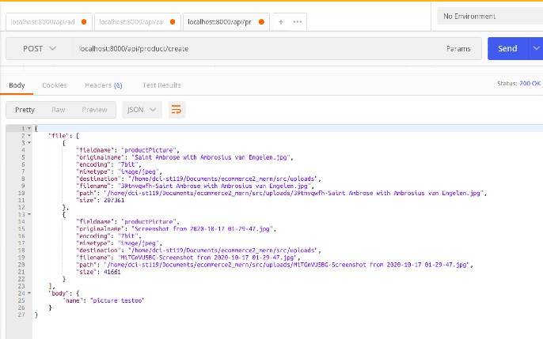]()

<br>
<br>
<br>
<hr>
<br>

#### CREATE THE PRODUCT

- GO TO THE CONTROLLER/products.js

- HIDE THIS

```javascript
res.status(200).json({ file: req.files, body: req.body });
```

- ADD THE FOLLOWING

```javascript
    name: {
      type: String,
      required: true,
      trim: true,
    },
    slug: {
      type: String,
      required: true,
      unique: true,
    },
    price: {
      type: Number,
      required: true,
    },
    description: {
      type: String,
      required: true,
      trim: true,
      //   max: 5000, this is for the length of the description
    },
    // this is not "required", because offers on a product are not something permanent.
    offer: {
      type: Number,
    },
    productPictures: [{ img: { type: String } }],
    // here we will tell "who" can write a review on the product
    // Ref: "User" }], YOU ARE MAKING REFERENCE to the User Schema we have inside the user.js/MODELS and what the User contains: module.exports = mongoose.model("User", userSchema);
    reviews: [
      // here we are going to use the LINKING, it means that the person posting a review must have an account
      {
        userId: { type: mongoose.Schema.Types.ObjectId, ref: "User" },
        review: String,
      },
      // So if that person needs to add a review, it needs to be logged in
    ],
    category: {
      type: mongoose.Schema.Types.ObjectId,
      ref: "Category",
    },
    createdBy: {
      type: mongoose.Schema.Types.ObjectId,
      ref: "User",
    },
    updatedAt: Date,
```

- YOU WILL ADD THAT PIECE OF CODE (from the product schema) , inside here:

```javascript
//                        ****  P R O D U C T     ****
//                               controller
//
//
//
const Product = require("../models/product");

exports.createProduct = (req, res) => {
  // HIDE THIS (RELATED TO MULTIPLE IMAGES)
  // res.status(200).json({ file: req.files, body: req.body });
);

  const product = new Product({
//      YOU WILL ADD THE CODE HERE ***
  });
};
```

- FROM THAT CODE (that will serve to check what you will be grabbing)

  - ITS MORE EASY to copy and paste the code here than cheking the schema all the time.

  - SO create a variable and add the things you will take from the schema

- ADD SLUGIFY

```javascript
//                        ****  P R O D U C T     ****
//                               controller
//
//
//
const Product = require("../models/product");

exports.createProduct = (req, res) => {
  // HIDE THIS (RELATED TO MULTIPLE IMAGES)
  // res.status(200).json({ file: req.files, body: req.body });

  const product = new Product({
    //      YOU WILL ADD THE CODE HERE ***
  });
};
```

<br>
<br>

#### IT SHOULD LOOK LIKE THIS

- SO HERE YOU ARE CREATING THE PRODUCT AND saving it
  <br>

```javascript
const shortid = require("shortid");
const Product = require("../models/product");
const slugify = require("slugify");
//
//                        ****  P R O D U C T     ****
//                               controller
//
//
//

exports.createProduct = (req, res) => {
  // the line below will help in the validation
  // 1
  const {
    name,
    price,
    description,
    productPictures,
    category,
    createdBy,
  } = req.body;
  // 2
  const product = new Product({
    name: req.body.name,
    slug: slugify(name),
    price,
    description,
    productPictures,
    category,
    createdBy: req.user._id,
  });
  //3  now SAVE the steps and HANDLE the ERRORS

  product.save().exec((error, product) => {
    //
    // ERROR HANDLING
    // if there is an error, return a response 400 with a message json that says "error"
    if (error) return res.status(400).json({ error });
    // if the saving was successful, show the product
    if (product) {
      res.status(201).json({ product });
    }
  });
};
```

<br>
<br>

#### WE ARE GOING TO CHANGE SOME THINGS

- WE ARE GOING TO USE THE "productPictures" array as a "file", like we already had it when we tested the single and multiple images:

```javascript
{
    "file": [
        {
            "fieldname": "productPicture",
            "originalname": "Saint Ambrose with Ambrosius van Engelen.jpg",
            "encoding": "7bit",
            "mimetype": "image/jpeg",
            "destination": "/home/dci-st119/Documents/ecommerce2_mern/src/uploads",
            "filename": "39tnvqwfh-Saint Ambrose with Ambrosius van Engelen.jpg",
            "path": "/home/dci-st119/Documents/ecommerce2_mern/src/uploads/39tnvqwfh-Saint Ambrose with Ambrosius van Engelen.jpg",
            "size": 207361
        },
        {
            "fieldname": "productPicture",
            "originalname": "Screenshot from 2020-10-17 01-29-47.jpg",
            "encoding": "7bit",
            "mimetype": "image/jpeg",
            "destination": "/home/dci-st119/Documents/ecommerce2_mern/src/uploads",
            "filename": "MiTGnVU5BG-Screenshot from 2020-10-17 01-29-47.jpg",
            "path": "/home/dci-st119/Documents/ecommerce2_mern/src/uploads/MiTGnVU5BG-Screenshot from 2020-10-17 01-29-47.jpg",
            "size": 41661
        }
    ],
    "body": {
        "name": "picture testoo"
    }
}
```

<br>
<br>

> FOR THAT WE WILL HAVE TO SET UP AN if statement and map through the data "files"

```javascript
//                        ****  P R O D U C T     ****
//                               controller
//
//
//

exports.createProduct = (req, res) => {
  // the line below will help in the validation
  // 1   ------------------
  const { name, price, description, category, createdBy } = req.body;

  // 5 remove the productPictures from the step 1
  // 6 add it here
  let productPictures = [];
  // in allusion to this: upload.array("productPicture"),

  // 4 ------------------
  //  if you have more than 0 (which means if you have at least a image)
  if (req.file.length > 0) {
    // 7 so map the pictures inside the "files" which is productPicture data from the outside
    productPictures = req.files.map((file) => {
      // return the image, with this you practically have the result of the precedent tests
      // ASK ROBERT ABOUT why all this?
      // before: return file.filename;
      //
      return { img: file.filename };
      /*
      
      You cannot show it like this : return file.filename;
      and the reason for that is because inside the product
       schema we have it like so:
      
       productPictures: [{ img: { type: String } }],

       As you can see, its an array with an object inside of it
      
      */
    });
  }

  // 2 ------------------
  const product = new Product({
    name: req.body.name,
    slug: slugify(name),
    price,
    description,
    productPictures,
    category,
    createdBy: req.user._id,
  });

  //3  ------------------
  // now SAVE the steps and HANDLE the ERRORS

  product.save().exec((error, product) => {
    //
    // ERROR HANDLING
    // if there is an error, return a response 400 with a message json that says "error"
    if (error) return res.status(400).json({ error });
    // if the saving was successful, show the product
    if (product) {
      res.status(201).json({ product });
    }
  });
};

/*
--------
createdBy: req.user._id
its automatically generated depending of the admin that is creating the product
---------

req.body 
holds parameters that are sent up 
from the client as part of a POST request. 

See the API.

// POST user[name]=tobi&user[email]=tobi@learnboost.com
req.body.user.name
// => "tobi"

req.body.user.email
// => "tobi@learnboost.com"

// POST { "name": "tobi" }
req.body.name
// => "tobi"


*/
```

##### NOW GO AND TEST IT ON POSTMAN

> THE ERROR

```javascript
<!DOCTYPE html>
<html lang="en">
    <head>
        <meta charset="utf-8">
        <title>Error</title>
    </head>
    <body>
        <pre>TypeError: Cannot read property &#39;length&#39; of undefined
            <br> &nbsp; &nbsp;at exports.createProduct (/home/dci-st119/Documents/ecommerce2_mern/src/controller/product.js:23:16)
            <br> &nbsp; &nbsp;at Layer.handle [as handle_request] (/home/dci-st119/Documents/ecommerce2_mern/node_modules/express/lib/router/layer.js:95:5)
            <br> &nbsp; &nbsp;at next (/home/dci-st119/Documents/ecommerce2_mern/node_modules/express/lib/router/route.js:137:13)
            <br> &nbsp; &nbsp;at Immediate.&lt;anonymous&gt; (/home/dci-st119/Documents/ecommerce2_mern/node_modules/multer/lib/make-middleware.js:53:37)
            <br> &nbsp; &nbsp;at processImmediate (internal/timers.js:446:21)
        </pre>
    </body>
</html>
```

> THE ERROR: TypeError: Cannot read property &#39;length&#39; of undefined
> Its due to the fact that we didnt UPLOAD any new image

- THERE S ALSO A MISTAKE in the if statement

```javascript
// there s the "s" missing
 if (req.file.length > 0) {
  //  correction
   if (req.files.length > 0) {
```

<br>

#### AFTER THOSE CHANGES, there will be another ERROR :)

<br>

`<pre>TypeError: product.save(...).exec is not a function`

- its related to the .exec

<br>

```javascript
// instead of this
  product.save().exec((error, product) => {
    if (error) return res.status(400).json({ error });
    if (product) {
      res.status(201).json({ product });
    }
  });
};
// add this
  product.save(((error, product) => {
    if (error) return res.status(400).json({ error });
    if (product) {
      res.status(201).json({ product });
    }
  }));
};
```

<br>

#### NOW GO TO POSTMAN AND TEST IT AGAIN

> RESULT

<br>

```javascript
{
    "error": {
        "errors": {
            "price": {
                "name": "ValidatorError",
                "message": "Path `price` is required.",
                "properties": {
                    "message": "Path `price` is required.",
                    "type": "required",
                    "path": "price"
                },
                "kind": "required",
                "path": "price"
            },
            "description": {
                "name": "ValidatorError",
                "message": "Path `description` is required.",
                "properties": {
                    "message": "Path `description` is required.",
                    "type": "required",
                    "path": "description"
                },
                "kind": "required",
                "path": "description"
            }
        },
        "_message": "Product validation failed",
        "message": "Product validation failed: price: Path `price` is required., description: Path `description` is required."
    }
}
```

<br>

### It worked!!

##### THE ERRORS in the result refer to all empty fields we still need to FILL

- I also noticed we dont have a "quantity field" inside the model of the products

> Without it we dont have a stock of a product,

- GO BACK to the controllers/products.js and add quantity like so:

<br>

```javascript
exports.createProduct = (req, res) => {

  const { name, price, quantity, description, category, createdBy } = req.body;
  let productPictures = [];

  if (req.files.length > 0) {

    productPictures = req.files.map((file) => {

      return { img: file.filename };

    });
  }

  //  ------------------
  const product = new Product({
    name: name,
    slug: slugify(name),
    price,
    quantity,
    description,
    productPictures,
    category,
    createdBy: req.user._id,
  });
```

<br>

#### TEST IT AGAIN

- CLICK ON THE IMAGES TO SEE THE STEPS TO FOLLOW ON POSTMAN, as you need to create new fields there and add the respective information.

[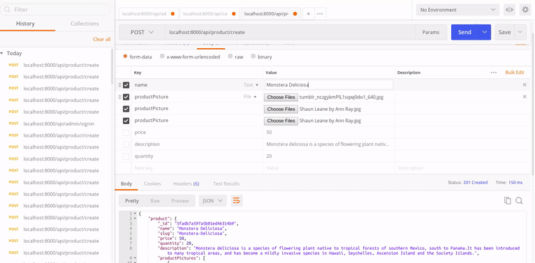](https://www.youtube.com/watch?v=Y6MytW7pLOY)

<br>

##### RESULT

```javascript
{
    "product": {
        "_id": "5fadb8b297a5b01ed46314bd",
        "name": "Monstera Deliciosa",
        "slug": "Monstera-Deliciosa",
        "price": 50,
        "quantity": 20,
        "description": "Monstera deliciosa is a species of flowering plant native to tropical forests of southern Mexico, south to Panama.It has been introduced to many tropical areas, and has become a mildly invasive species in Hawaii, Seychelles, Ascension Island and the Society Islands.",
        "productPictures": [
            {
                "_id": "5fadb8b297a5b01ed46314be",
                "img": "D1aQ2L4_9-tumblr_nczgykmPlL1sqwj0do1_640.jpg"
            },
            {
                "_id": "5fadb8b297a5b01ed46314bf",
                "img": "YHuZpHTvjw-Shaun Leane by Ann Ray.jpg"
            },
            {
                "_id": "5fadb8b297a5b01ed46314c0",
                "img": "L-Kj1SfcHP-Shaun Leane by Ann Ray.jpg"
            }
        ],
        "createdBy": "5fa99d1ada0e6456cdb04bbf",
        "reviews": [],
        "createdAt": "2020-11-12T22:35:30.352Z",
        "updatedAt": "2020-11-12T22:35:30.352Z",
        "__v": 0
    }
}
```

[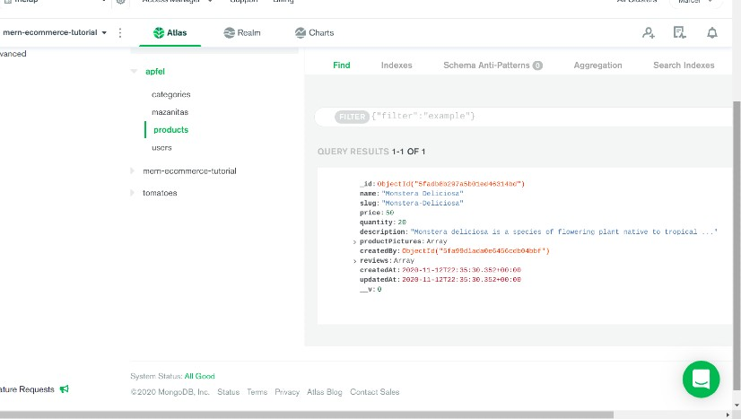]()

<br>
<br>
<br>

#### MONGO PRODUCT ERROR

- If you get this ERROR , its because you have this product record inside the database.

```javascript
{
    "error": {
        "driver": true,
        "name": "MongoError",
        "index": 0,
        "code": 11000,
        "keyPattern": {
            "slug": 1
        },
        "keyValue": {
            "slug": "Monstera-Deliciosa"
        }
    }
}
```

###### TO SOLVE IT:

- GO TO MONGO
- CHECK THE PRODUCTS
- DELETE THE SIMILAR PRODUCT OR CHANGE THE PRODUCTS NAME WHEN YOU ARE CREATING THE PRODUCT.

<br>
<br>
<br>

<br>

#### WE STILL NEED TO ADD FEW THINGS (to the schema)

- ADD THE FOLLOWING inside the products schema

```javascript
required: true,
```

- TO THE the following fields, like so:

```javascript
  category: {
      type: mongoose.Schema.Types.ObjectId,
      ref: "Category",
      required: true,
    },
    createdBy: {
      type: mongoose.Schema.Types.ObjectId,
      ref: "User",
      required: true,
    },
```

#### AFTER ADDING THE FIELDS , TEST IT AGAIN IN POSTMAN

- YOU WILL GET THIS ERROR

```javascript
{
    "error": {
        "errors": {
            "category": {
                "name": "ValidatorError",
                "message": "Path `category` is required.",
                "properties": {
                    "message": "Path `category` is required.",
                    "type": "required",
                    "path": "category"
                },
                "kind": "required",
                "path": "category"
            }
        },
        "_message": "Product validation failed",
        "message": "Product validation failed: category: Path `category` is required."
    }
}
```

##### THE ERROR SAYS:

> "message": "Path `category` is required.",

#### GO TO POSTMAN

- INSIDE THE : localhost:8000/api/category/getcategory

- COPY THE PRODUCT ID inside the category of the product

[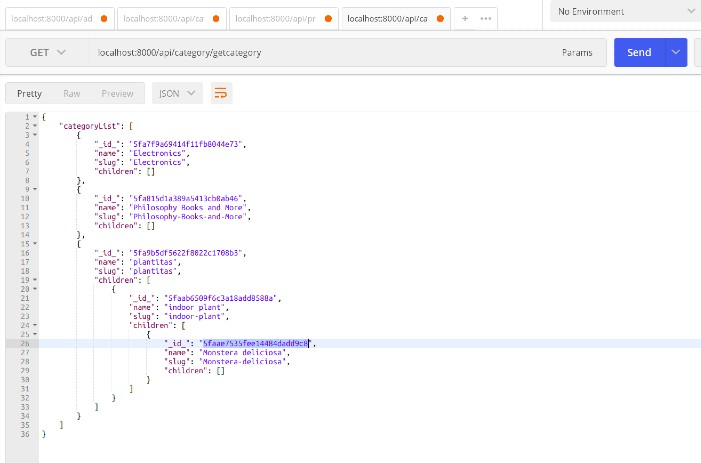]()

<br>

#### AFTERWARDS

- PAST THE ID inside the: localhost:8000/api/product/create

- CREATE THE CATEGORY LIKE SO:

[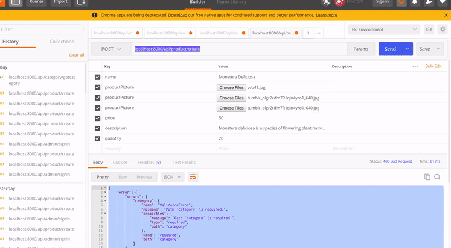]()

<br>

#### RESULT IN POSTMAN

```javascript
{
    "product": {
        "_id": "5fafaa8a68a590754956e890",
        "name": "Monstera Deliciosa",
        "slug": "Monstera-Deliciosa",
        "price": 50,
        "quantity": 20,
        "description": "Monstera deliciosa is a species of flowering plant native to tropical forests of southern Mexico, south to Panama.It has been introduced to many tropical areas, and has become a mildly invasive species in Hawaii, Seychelles, Ascension Island and the Society Islands.",
        "productPictures": [
            {
                "_id": "5fafaa8a68a590754956e891",
                "img": "K2TuTXAdF-vvb41.jpg"
            },
            {
                "_id": "5fafaa8a68a590754956e892",
                "img": "irf4Ag6lkv-tumblr_olgr2rdm7R1qln4yro1_640.jpg"
            },
            {
                "_id": "5fafaa8a68a590754956e893",
                "img": "LuK1ZiadNi-tumblr_olgr2rdm7R1qln4yro1_640.jpg"
            }
        ],
        "category": "5faae7535fee14484dadd9c8",
        "createdBy": "5fa99d1ada0e6456cdb04bbf",
        "reviews": [],
        "createdAt": "2020-11-14T09:59:38.948Z",
        "updatedAt": "2020-11-14T09:59:38.948Z",
        "__v": 0
    }
}
```

#### RESULT IN THE DATABASE

[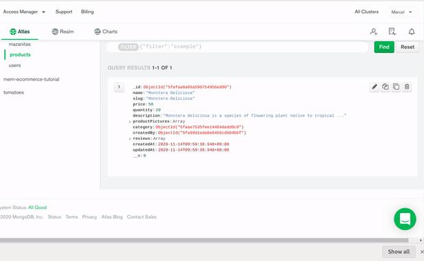]()

<br>
<br>
<br>
<br>

##### HOW TO FETCH THE PRODUCTS

[PRODUCTS PROCESS](src/docs/ADDPRODUCT_TO_CART.md)
