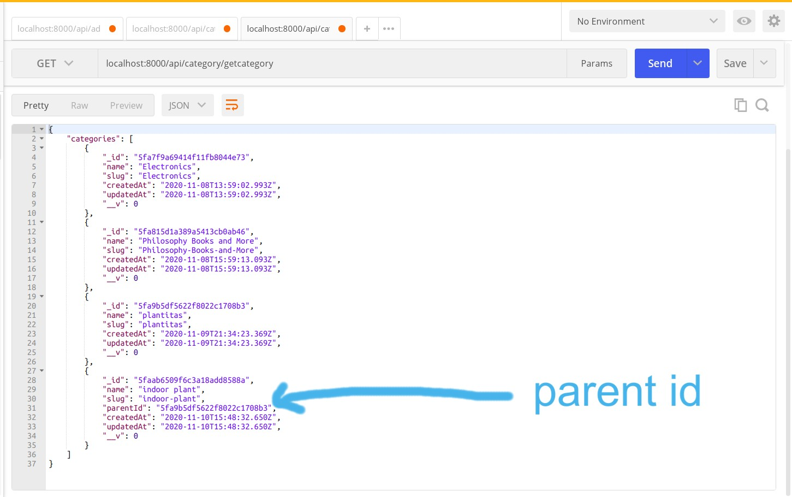

# :closed_lock_with_key: SUBCATEGORIES :closed_lock_with_key:

#### Start with the category "ELECTRONICS"

- the "ELECTRONICS" was the first category we created

- GO TO POSTMAN and type this to check all the categories:

`localhost:8000/api/category/getcategory`

- GET method , then click send


### ADD SUB-CATEGORIES TO THE "electronic" CATEGORY

- COPY THE CODE "\_id" from the electronic category (check the above picture)

` "_id": "5fa7f9a69414f11fb8044e73",`

- This "\_id" will serve as a PARENT id

##### STILL IN POSTMAN

- OPEN another tab

- Click on the image to follow the steps

###### WARNING!!

- DONT use the same CATEGORY name for a SUB category

[](https://www.youtube.com/watch?v=yLlgVCLhuN4)

- So in such way you can add several subcategories to the categories

- result



- YOU CAN CREATE BRANCHES INSIDE THE SUBCATEGORY BY USING THE "SUBCATEGORY \_ID" and PROCEDING LIKE YOU DID "TO CREATE A SUBCATEGORY" (CHECK THE VIDEO 1 img above)

<br>

#### NOW CREATE A FUNCTION TO FETCH THE SUBCATEGORIES :camel:

- CREATE A RECURSIVE FUNCTION

##### what is a recursive function?

<p>Recursive function is a fucntion that calls itself. WHEN writing recursive fucntions there must be a definite BREK POINT condition, otherwise we risk creating infinite loops</p>

<br>

##### GO TO THE categories.js CONTROLLER

- - inside the postman

[](https://youtu.be/3LMvCXZwnzc)

<br>

##### HERE YOU CAN NOTICE the name change in the arrays containing the categories

- before it was categories[] now it s categoryList[]

```javascript
/*
PUSHING THE SUBCATEGORY OBJECT TO THE CATEGORY

  for (let cate of category) {
    // it will push an object
    categoryList.push({
      _id_: cate._id,
      name: cate.name,
      slug: cate.slug,
      // here below is the recursive call, in the call you are passing the complete categories
      // which is "categories" , then to filter the result you are going to pass the id of the current id  (categories, cate._id),
      children: createCategories(categories, cate._id),
    });
  }


*/
{
    "categoryList": [
// THIS IS THE OBJECT PUSHED TO THE CATEGORY
        {
            "_id_": "5fa9b5df5622f8022c1708b3",
            "name": "plantitas",
            "slug": "plantitas",
            "children": [
                {
                    "_id_": "5faab6509f6c3a18add8588a",
                    "name": "indoor plant",
                    "slug": "indoor-plant",
                    "children": []
                }
            ]
        }
    ]
}
```